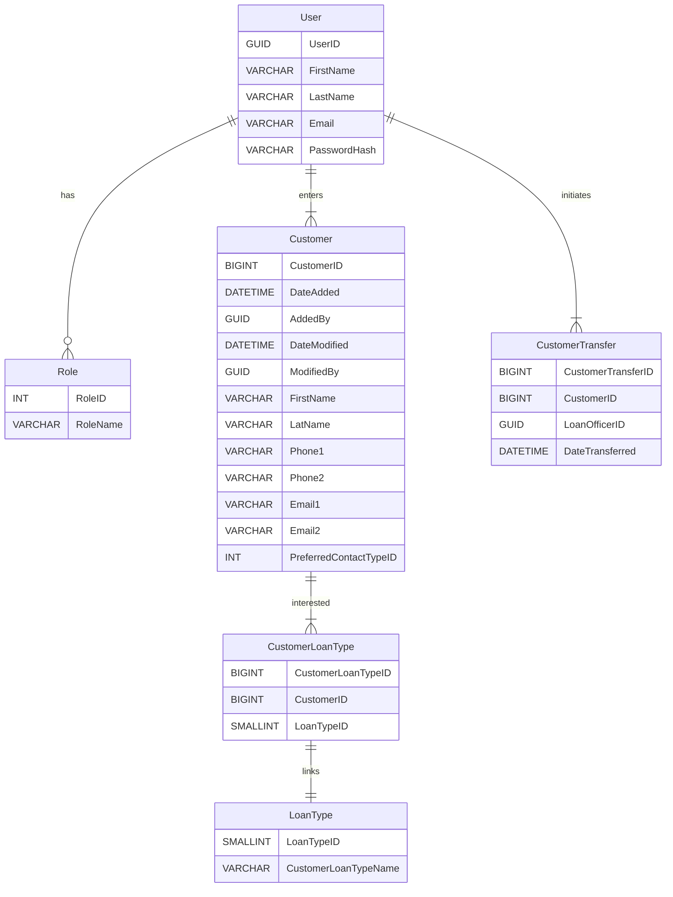

# **Lead Software Developer Interview Scenario**

## **Index**

1. [Overview](#1-overview)
    - [Goal](#11-goal)
    - [Jargon](#12-jargon)
2. [System Architecture](#2-system-architecture)
   - [Technology Stack](#21-technology-stack)
3. [System Components](#3-system-components)
   - [Frontend Features](#31-frontend-features)
   - [Backend Features](#32-backend-features)
   - [Database Schema](#33-database-schema)
4. [Questions](#4-questions)

- External Documents
  - [Figma Slides](https://www.figma.com/design/Ygl48isZkqzXW8TmQKqIko/Contact-Entry?node-id=0-1&t=dhwOyY3iCaQO9rDj-1)
- Nuget Packages
  - [Dapper](https://github.com/DapperLib/Dapper)
  - [FusionCache](https://github.com/ZiggyCreatures/FusionCache)
  - [Microsoft Resilience](https://github.com/dotnet/extensions/blob/main/src/Libraries/Microsoft.Extensions.Http.Resilience/README.md)
  - [XUnit](https://github.com/xunit/xunit)
  - [Playwright](https://github.com/microsoft/playwright)

---

## **1. Overview**

### **1.1 Goal**

Enable sales personnel to efficiently collect and manage potential customer information and transfer to a loan officer.

### **1.2 Jargon**
|Term|Expanded|Definition|
|----|--------|----------|
|API |Application Programming Interface|A system for exposing data to websites or other APIs|
|JWT |JSON Web Token|Security Token passed to API to prove Authentication|

---

## **2. System Architecture**

### **2.1 Technology Stack**

- **Frontend:** Vue 3 on Vite for a modern, responsive UI
- **Backend:** .NET Core for API services
  - **Dapper** for SQL call management
  - **FusionCache** for quick responses
  - **Microsoft Resilience** for retry and fallback logic
- **Database:** **MSSQL** for structured data storage
- **Authentication:** **OAuth 2.0 / JWT** for secure user access
- **Testing**
  - **XUnit** Framework
  - **Playwright** For front end and end to end testing
---

## **3. System Components**

### **3.1 Frontend Features**

- **Authentication System:** Secure login, logout, and session management features. Possibly tying into existing Single Sign-On if available
- **Search & Filter:** Enables sales personnel to filter and search customer records by demographics.
- **Customer Data Entry Form:** Capture contact details, loan products of interest, and preferred contact methods.
- **Customer Transfer:** Provides an interface for seamlessly transferring customers to loan officers.

### **3.2 Backend Features**

- **Customer Endpoints:** Supports create, read, update, and delete operations for customer records.
- **Search & Filter Endpoints:** Provides demographic based query functionality.
- **Transfer Endpoint:** Connects with an existing API for customer handoff to loan officers.
- **Authentication Middleware:** Ensures secure access to API endpoints and across shared APIs using JWTs.

### **3.3 Database Schema**
Users will be created with Roles to govern access rights.

Users will make entries into the Customers Table

## **4. Questions**

### **4.1 External Demographic Information?**
For use in the search data, will we be pulling any additional demographic information for searching? 

### **4.2 Address Autofill Service?**
Would we like to integrate with an address matching service to increase speed and accuracy of customer entry?

### **4.3 Single Transfer?**
Above I've accounted for the possibility of multiple Customer Transfers. Is this actually a scenario we'll run into? Or would moving the `LoanOfficerID` and `DateTransferred` columns into the `Customer` table be sufficient.

### **4.4 Data Hash support?**
Do we see the need for a Data Hash to be generated on the loading of the Contact Entry Form to prevent edits from being saved if another Rep saves new changes before we finish?